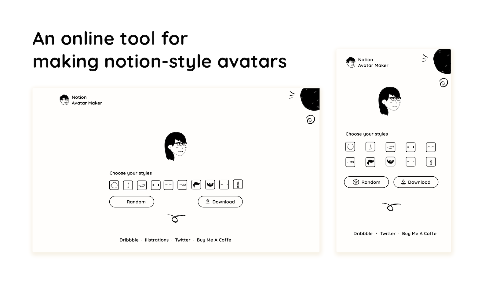

# Notion Avatar Maker

An online tool for making notion-style avatars.

I18n supported:

- [English](https://notion-avatar.vercel.app/en)
- [简体中文](https://notion-avatar.vercel.app/zh)
- [한국어](https://notion-avatar.vercel.app/ko)

## Styles

- 😉 16 face shapes
- 👃🏼 14 noses
- 👄 20 mouths
- 👀 14 eyes
- 👁️ 16 eyebrows
- 🕶️ 14 glasses
- 💇‍♀️ 58 hairstyles
- 🎅🏼 16 beards
- 💋 13 facial details
- 💍 14 accessories

## Assets

- Illustration designer: [@Felix Wong](https://www.producthunt.com/@felix12777) on ProductHunt
- Pack of illustrations: [Noto avatar](https://abstractlab.gumroad.com/l/noto-avatar)
- Assets licensed under [CC0](https://creativecommons.org/publicdomain/zero/1.0/) 

## Contact

- Open an [issue](https://github.com/Mayandev/notion-avatar/issues) if you have any question about this app.
- DM me on [twitter](https://twitter.com/phillzou) is also welcome.

